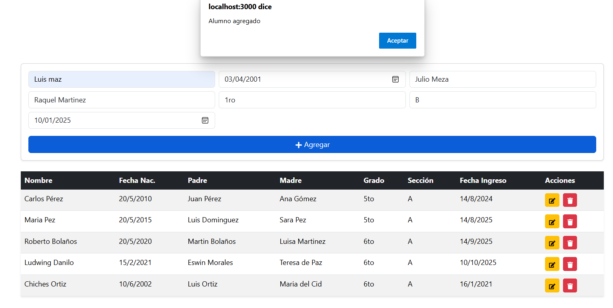
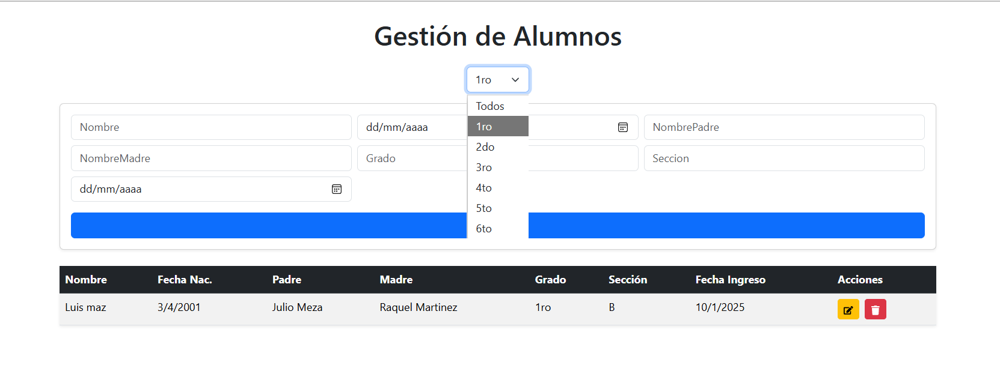
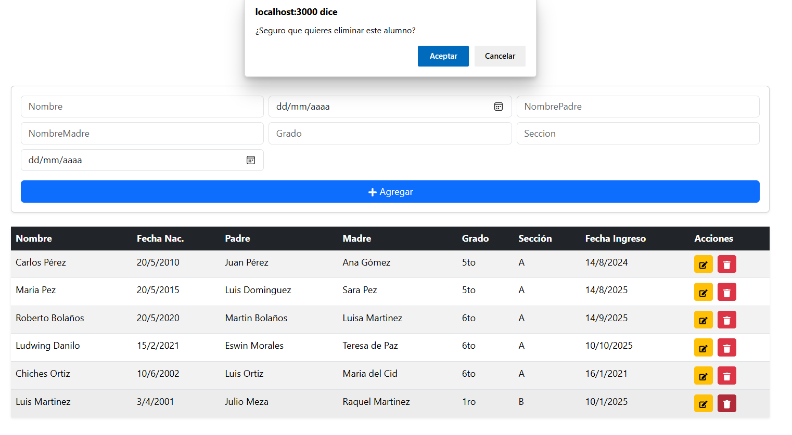
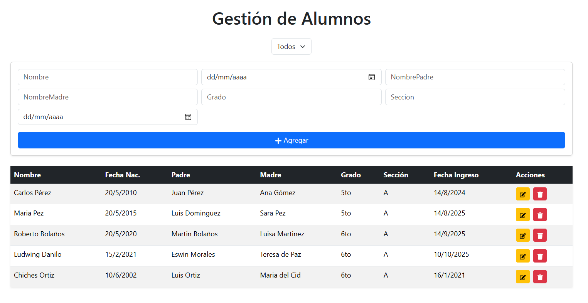

#  Gestión de Alumnos - .NET + React

Este proyecto es una aplicación Full Stack que permite gestionar alumnos mediante un **API REST en .NET** con seguridad por **API Key** y un **Front-End en React** con Bootstrap para la interfaz.

---

## 📂 Estructura del proyecto


📦 mi-proyecto
┣ 📂 back-end # API en .NET
┃ ┣ 📂 Controllers # Controladores (AlumnosController, etc.)
┃ ┣ 📂 Models # Modelos de datos
┃ ┣ 📜 Program.cs # Configuración principal de la API
┃ ┣ 📜 appsettings.json # Configuración de DB y API Key
┃ ┗ 📜 ... # Otros archivos .NET
┃
┣ 📂 front-end # Aplicación React
┃ ┗ 📂 alumnos-app # Proyecto React creado con Create React App
┃ ┣ 📂 public # Archivos públicos (index.html, favicon, etc.)
┃ ┣ 📂 src # Código fuente React
┃ ┃ ┣ 📜 App.js # Lógica principal
┃ ┃ ┣ 📜 App.css # Estilos principales
┃ ┃ ┣ 📜 index.js # Punto de entrada
┃ ┃ ┗ 📜 ... # Otros componentes
┃ ┣ 📜 package.json # Dependencias React
┃ ┗ 📜 ... # Otros archivos generados
┃
┣ 📜 README.md # Documentación del proyecto
┗ 📜 ... # Otros archivos generales


## 🛠 Tecnologías utilizadas

### Back-End
- C#
- .NET Web API
- Entity Framework Core
- MySQL
- API Key Authentication
- Swagger

### Front-End
- React
- Bootstrap 5
- Axios
- React Icons

---

##  Instalación y ejecución

### 1️⃣ Clonar el repositorio
```bash
git clone https://github.com/ludgmors/feature-LudwingMorales.git
cd feature-LudwingMorales


2️⃣ Configurar el Back-End

 
# 1 Ir a la carpeta back-end:

cd back-end


# 2 Instalar dependencias:

dotnet restore

# 3 Configurar conexión a MySQL en appsettings.json:

"ConnectionStrings": 
{
  "DefaultConnection": "Server=localhost;Database=AlumnosDB;User=root;Password=tu_password;"
},
"ApiKey": "mi-api-key-123"


# 4 Aplicar migraciones:

dotnet ef database update

# 5 Ejecutar el servidor:

dotnet run


El API estará disponible en: https://localhost:5194


3️⃣ Configurar el Front-End

# 1 Ir a la carpeta front-end:

cd ../front-end

# 2 Instalar dependencias:

npm install

# 3 Modificar la URL del API y la API Key en App.js:

const API_URL = "http://localhost:5194/api/alumnos";
const API_KEY = "mi-api-key-123";

# 4 Ejecutar el proyecto:

npm start


El Front-End estará en: http://localhost:3000


🛜 Funcionalidades

✅ Insertar alumnos
✅ Listar todos los alumnos
✅ Filtrar por grado
✅ Editar alumno
✅ Eliminar alumno
✅ Seguridad por API Key


## Capturas de pantalla del funcionamiento 









📧 Autor: Ludwing Morales 
