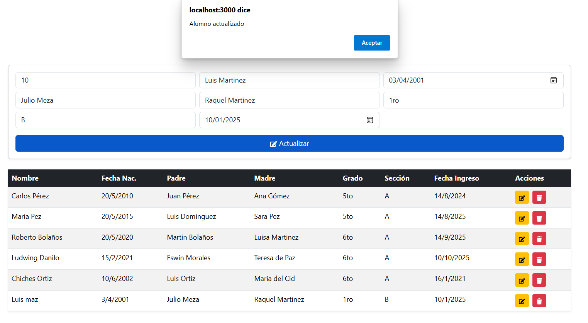

#  Gestión de Alumnos - .NET + React

Este proyecto es una aplicación Full Stack que permite gestionar alumnos mediante un **API REST en .NET** con seguridad por **API Key** y un **Front-End en React** con Bootstrap para la interfaz.

---

## 📂 Estructura del Proyecto
```
mi-proyecto/
│
├── back-end/                 # API en .NET
│   ├── Controllers/           # Controladores (AlumnosController, etc.)
│   ├── Models/                # Modelos de datos
│   ├── Program.cs             # Configuración principal de la API
│   ├── appsettings.json       # Configuración de DB y API Key
│   └── ...                    # Otros archivos .NET
│
├── front-end/                 # Aplicación React
│   └── alumnos-app/           # Proyecto React creado con Create React App
│       ├── public/            # Archivos públicos (index.html, favicon, etc.)
│       ├── src/               # Código fuente React
│       │   ├── App.js         # Lógica principal
│       │   ├── App.css        # Estilos principales
│       │   ├── index.js       # Punto de entrada
│       │   └── ...            # Otros componentes
│       ├── package.json       # Dependencias React
│       └── ...                # Otros archivos generados
│
├── README.md                  # Documentación del proyecto
└── ...                        # Otros archivos generales
```

## 🛠 Tecnologías utilizadas

### Back-End
- C#
- .NET Web API
- Entity Framework Core
- MySQL
- API Key Authentication
- Swagger

### Front-End
- React
- Bootstrap 5
- Axios
- React Icons

---

##  Instalación y ejecución

### 1️⃣ Clonar el repositorio
```bash
git clone https://github.com/ludgmors/feature-LudwingMorales.git
cd feature-LudwingMorales

📦 Instalación de dependencias
ve al Archivo INSTALL.md, he instala las dependencias 

2️⃣ Configurar el Back-End

 
# 1 Ir a la carpeta back-end:

cd back-end


# 2 Instalar dependencias:

dotnet restore

# 3 Configurar conexión a MySQL en appsettings.json:

"ConnectionStrings": 
{
  "DefaultConnection": "Server=localhost;Database=AlumnosDB;User=root;Password=tu_password;"
},
"ApiKey": "mi-api-key-123"


# 4 Aplicar migraciones:

dotnet ef database update

# 5 Ejecutar el servidor:

dotnet run


El API estará disponible en: https://localhost:5194


3️⃣ Configurar el Front-End

# 1 Ir a la carpeta front-end:

cd ../front-end

# 2 Instalar dependencias:

npm install

# 3 Modificar la URL del API y la API Key en App.js:

const API_URL = "http://localhost:5194/api/alumnos";
const API_KEY = "mi-api-key-123";

# 4 Ejecutar el proyecto:

npm start


El Front-End estará en: http://localhost:3000


🛜 Funcionalidades

✅ Insertar alumnos
✅ Listar todos los alumnos
✅ Filtrar por grado
✅ Editar alumno
✅ Eliminar alumno
✅ Seguridad por API Key


## Capturas de pantalla del funcionamiento 





📧 Autor: Ludwing Morales 
